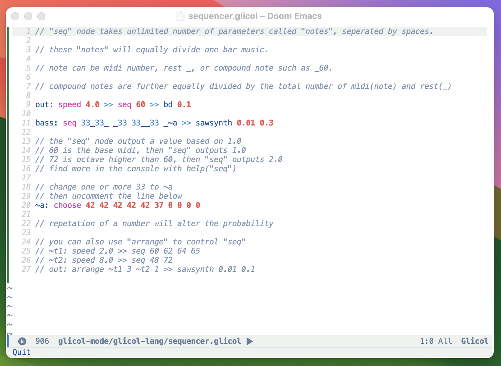
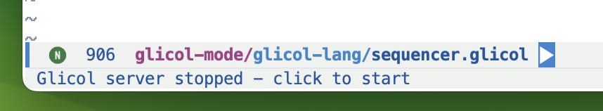

# Glicol Mode for Emacs

An Emacs major mode for the [Glicol](https://glicol.org) audio programming language.

## Features

- Syntax highlighting for Glicol code
- Smart code completion with documentation
- Integration with glicol-cli
- Built-in commands for controlling the Glicol server
- Doom Emacs integration
- Real-time documentation lookup
- Intelligent context-aware suggestions





## Installation

### Prerequisites

- Emacs 26.1 or later
- [glicol-cli](https://github.com/glicol/glicol-cli) installed and available in your PATH

### Manual Installation

Clone this repository:

```bash
git clone https://github.com/khtdr/glicol-mode.git
```

Add to your `init.el`:

```elisp
(add-to-list 'load-path "/path/to/glicol-mode")
(require 'glicol-mode)
```

### With straight.el

```elisp
(straight-use-package
  '(glicol-mode :type git :host github :repo "khtdr/glicol-mode"))
```

### With use-package

```elisp
(use-package glicol-mode
  :load-path "/path/to/glicol-mode"
  :mode "\\.glicol\\'")
```

### Doom Emacs Users

Add to your `packages.el`:

```elisp
(package! glicol-mode
  :recipe (:host github :repo "khtdr/glicol-mode"))
```

## Usage

Files with the `.glicol` extension will automatically open in Glicol mode.

### Key Bindings

- `C-c C-s` - Start the Glicol server
- `C-c C-q` - Quit the Glicol server
- `C-c C-c` - Check server status
- `C-c C-r` - Restart the server
- `C-c C-b` - Set BPM (beats per minute)

For Doom Emacs users, the modeline will show the Glicol server status with clickable buttons to start/stop the server.

### Customization

You can customize the path to the glicol-cli executable:

```elisp
;; Set the path to glicol-cli:
(setq glicol-cli-command "/path/to/glicol-cli")

;; Set the default BPM (beats per minute):
(setq glicol-bpm 120)
```

## Contributing

Contributions are welcome! Please feel free to submit a Pull Request.

## License

This project is licensed under the GPL-3.0 License - see the LICENSE file for details.
